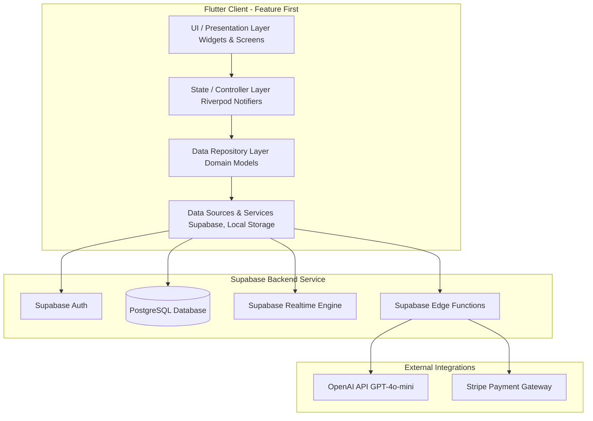
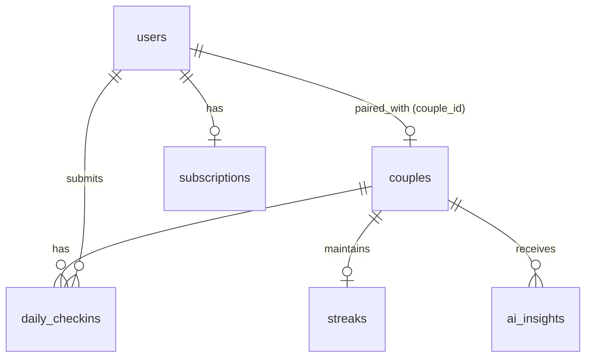

# MVP Architecture Plan: Daily Emotional Ritual App for LDR Couples

We are building a production-grade, highly scalable, and beautifully designed MVP for a daily emotional ritual app. This application is optimized for Gen Z and Millennial long-distance couples, emphasizing connection, daily check-ins, and AI-generated insights. The tech stack utilizes **Flutter** and **Riverpod** on the frontend, with **Supabase (PostgreSQL, Auth, Realtime, Edge Functions)** on the backend, integrated with **OpenAI API** and **Stripe**.

---

## High-Level Architecture Design

A Feature-first Clean Architecture will be employed in Flutter. This maintains modularity, ensures testability, and supports rapid iteration while preventing code pollution.



### Key Architectural Layers

1. **Presentation Layer (UI/Widgets/Screens)**: Declarative, highly-polished UI elements reacting directly to Riverpod providers. Minimal logic is embedded in the screens.
2. **State / Controller Layer (Riverpod)**: Powered by Riverpod 2.x and `@riverpod` annotations. Manages reactive app state, communicates with repositories, and controls caching and local predictions.
3. **Domain / Repository Layer**: Defines strong, type-safe data models and domain repository interfaces. Maps backend database payloads to clean Dart models.
4. **Data / Infrastructure Layer (Services/Data Sources)**: Interacts with the Supabase client, local cache (Shared Preferences), and third-party APIs. Handles low-level network errors and transformations.

---

## Database Schema (PostgreSQL)

The Supabase database consists of six core tables: `users`, `couples`, `daily_checkins`, `streaks`, `ai_insights`, and `subscriptions`. 



### Table Definitions & SQL DDL

```sql
-- Enable UUID extension if not enabled
create extension if not exists "uuid-ossp";

-- 1. Couples Table (Grouping mechanism for long-distance pairs)
create table public.couples (
    id uuid primary key default uuid_generate_v4(),
    created_at timestamp with time zone default timezone('utc'::text, now()) not null,
    invite_code varchar(8) unique not null,
    partner_1_id uuid references auth.users(id) on delete set null,
    partner_2_id uuid references auth.users(id) on delete set null,
    is_active boolean default true not null
);

-- 2. Users Profiles Table (Linked to Supabase Auth)
create table public.users (
    id uuid primary key references auth.users(id) on delete cascade,
    created_at timestamp with time zone default timezone('utc'::text, now()) not null,
    updated_at timestamp with time zone default timezone('utc'::text, now()) not null,
    email varchar not null,
    display_name varchar,
    avatar_url varchar,
    couple_id uuid references public.couples(id) on delete set null,
    fcm_token varchar,
    timezone varchar default 'UTC' not null,
    premium_tier boolean default false not null
);

-- 3. Daily Check-ins Table
create table public.daily_checkins (
    id uuid primary key default uuid_generate_v4(),
    created_at timestamp with time zone default timezone('utc'::text, now()) not null,
    user_id uuid references public.users(id) on delete cascade not null,
    couple_id uuid references public.couples(id) on delete cascade not null,
    mood_emoji varchar(10) not null,             -- Visual representation (e.g. "💖", "😴", "⚡")
    mood_label varchar(50) not null,             -- String category (e.g. "Excited", "Anxious", "Calm")
    affection_score integer check (affection_score >= 1 and affection_score <= 10) not null,
    stress_score integer check (stress_score >= 1 and stress_score <= 10) not null,
    energy_score integer check (energy_score >= 1 and energy_score <= 10) not null,
    journal_note text,                            -- Optional lightweight context
    shared_at timestamp with time zone default timezone('utc'::text, now()) not null
);

-- 4. Streaks Table
create table public.streaks (
    id uuid primary key default uuid_generate_v4(),
    couple_id uuid references public.couples(id) on delete cascade unique not null,
    current_streak integer default 0 not null,
    longest_streak integer default 0 not null,
    last_checkin_date date not null,              -- Kept in date format to calculate consecutive calendar days
    created_at timestamp with time zone default timezone('utc'::text, now()) not null,
    updated_at timestamp with time zone default timezone('utc'::text, now()) not null
);

-- 5. AI Insights Table
create table public.ai_insights (
    id uuid primary key default uuid_generate_v4(),
    couple_id uuid references public.couples(id) on delete cascade not null,
    created_at timestamp with time zone default timezone('utc'::text, now()) not null,
    start_date date not null,                     -- Start of summary period
    end_date date not null,                       -- End of summary period
    summary text not null,                        -- AI emotional wrap-up
    relationship_trends text[] not null,          -- Identified trends (arrays)
    connection_prompts text[] not null            -- Custom action steps suggested by AI
);

-- 6. Subscriptions Table
create table public.subscriptions (
    id uuid primary key default uuid_generate_v4(),
    user_id uuid references public.users(id) on delete cascade unique not null,
    stripe_customer_id varchar,
    stripe_subscription_id varchar,
    status varchar(50) not null,                  -- active, trialing, canceled, past_due, incomplete
    price_id varchar,
    current_period_start timestamp with time zone,
    current_period_end timestamp with time zone,
    cancel_at_period_end boolean default false not null,
    created_at timestamp with time zone default timezone('utc'::text, now()) not null,
    updated_at timestamp with time zone default timezone('utc'::text, now()) not null
);
```

### PostgreSQL Performance Indexes

```sql
-- Indexes for swift profile and pairing queries
create index idx_users_couple_id on public.users(couple_id);
create index idx_couples_invite_code on public.couples(invite_code);
create index idx_couples_partners on public.couples(partner_1_id, partner_2_id);

-- Daily check-in lookups (ordered descending for dashboard rendering)
create index idx_checkins_couple_created on public.daily_checkins(couple_id, created_at desc);
create index idx_checkins_user_date on public.daily_checkins(user_id, created_at desc);

-- Streaks speedups
create index idx_streaks_couple_id on public.streaks(couple_id);

-- AI Insights history view
create index idx_insights_couple_created on public.ai_insights(couple_id, created_at desc);
```

### Row-Level Security (RLS) Strategy

All tables will have Row-Level Security enabled. A strict validation scheme ensures partners can access only their own data or the shared records within their assigned couple group.

```sql
-- Enable RLS on all tables
alter table public.users enable row level security;
alter table public.couples enable row level security;
alter table public.daily_checkins enable row level security;
alter table public.streaks enable row level security;
alter table public.ai_insights enable row level security;
alter table public.subscriptions enable row level security;

-- 1. Users Table RLS Policies
create policy "Users can view their own profile and their partner's profile in the same couple"
on public.users for select
using (
    auth.uid() = id or 
    couple_id in (
        select couple_id from public.users where id = auth.uid()
    )
);

create policy "Users can update their own profile"
on public.users for update
using (auth.uid() = id);

-- 2. Couples Table RLS Policies
create policy "Couples can view their couple record if they belong to it"
on public.couples for select
using (
    auth.uid() = partner_1_id or auth.uid() = partner_2_id
);

create policy "Couples can insert/update if they are a participant"
on public.couples for all
using (
    auth.uid() = partner_1_id or auth.uid() = partner_2_id
);

-- 3. Daily Checkins RLS Policies
create policy "Users can view checkins of their couple"
on public.daily_checkins for select
using (
    couple_id in (
        select couple_id from public.users where id = auth.uid()
    )
);

create policy "Users can insert their own checkins"
on public.daily_checkins for insert
with check (
    auth.uid() = user_id and 
    couple_id in (
        select couple_id from public.users where id = auth.uid()
    )
);

-- 4. Streaks RLS Policies
create policy "Users can view streaks of their couple"
on public.streaks for select
using (
    couple_id in (
        select couple_id from public.users where id = auth.uid()
    )
);

-- 5. AI Insights RLS Policies
create policy "Users can view AI insights of their couple"
on public.ai_insights for select
using (
    couple_id in (
        select couple_id from public.users where id = auth.uid()
    )
);

-- 6. Subscriptions RLS Policies
create policy "Users can view only their own subscription"
on public.subscriptions for select
using (auth.uid() = user_id);
```

### Automation Triggers & Functions

To sync user accounts upon authentication instantly, we register a PostgreSQL trigger function that auto-populates a profile table row when an auth account is generated:

```sql
-- Automatically provision user record upon Supabase SignUp
create or replace function public.handle_new_user()
returns trigger as $$
begin
  insert into public.users (id, email, display_name, avatar_url, timezone, premium_tier)
  values (
    new.id,
    new.email,
    coalesce(new.raw_user_meta_data->>'display_name', split_part(new.email, '@', 1)),
    new.raw_user_meta_data->>'avatar_url',
    coalesce(new.raw_user_meta_data->>'timezone', 'UTC'),
    false
  );
  return new;
end;
$$ language plpgsql security definer;

create trigger on_auth_user_created
  after insert on auth.users
  for each row execute procedure public.handle_new_user();
```

---

## Folder Structure

The project implements a feature-oriented approach. Common mechanisms reside in `/lib/core` or `/lib/shared`, while features map to specialized self-contained modules.

```
/lib
├── main.dart                      # App entry point with ProviderScope
├── core/                          # Low-level core modules
│   ├── theme/                     # App design tokens, HSL colors, warm aesthetic
│   │   ├── colors.dart
│   │   └── typography.dart
│   ├── network/                   # Supabase client bootstrap, network error mappings
│   │   └── supabase_client.dart
│   ├── navigation/                # GoRouter/Navigator routes and guards
│   │   └── app_router.dart
│   └── utils/                     # Formatting utilities, helper extensions
│       └── datetime_helpers.dart
├── models/                        # Global strongly typed models
│   ├── user_model.dart
│   ├── couple_model.dart
│   ├── checkin_model.dart
│   ├── streak_model.dart
│   ├── insight_model.dart
│   └── subscription_model.dart
├── services/                      # Shared global infrastructure services
│   ├── auth_service.dart
│   ├── stripe_service.dart
│   ├── notification_service.dart
│   └── ai_insights_service.dart
├── shared/                        # Shared layouts and global constants
│   ├── constants/
│   └── widgets/                   # Global components: buttons, input fields, loaders
│       ├── custom_button.dart
│       ├── custom_textfield.dart
│       └── glass_card.dart        # Premium glassmorphic background card
└── features/                      # Domain features encapsulating logic & views
    ├── auth/                      # Authentication, Login, Register, Forget Pwd
    │   ├── providers/
    │   ├── screens/
    │   └── widgets/
    ├── onboarding/                # Profile set up, Couple Invite/Pairing
    │   ├── providers/
    │   ├── screens/
    │   └── widgets/
    ├── dashboard/                 # Shared central visual hub (Partner checkin states)
    │   ├── providers/
    │   ├── screens/
    │   └── widgets/
    ├── checkin/                   # Daily Checkin sliders & custom emoji selector
    │   ├── providers/
    │   ├── screens/
    │   └── widgets/
    ├── history/                   # Calendar overview & mood visual trackers
    │   ├── providers/
    │   ├── screens/
    │   └── widgets/
    └── settings/                  # User accounts, Profile tweaks, Subscription gating
        ├── providers/
        ├── screens/
        └── widgets/
```

---

## API & Data Flow

### 1. Daily Check-in & Sync Flow

1. User opens the dashboard. A Riverpod provider `todayCheckinProvider` checks if a check-in exists for today.
2. If absent, the Daily Check-in form is displayed (sliders for affection, stress, energy, emojis, optional journal entry).
3. On submission, the local UI optimism locks. A database mutation writes to the `daily_checkins` table.
4. The database registers the record. An automated update triggers checking for the daily pairing:
   * If both partners have checked in today, the `streaks` table increments `current_streak`.
5. The partner's app, listening to a **Supabase Realtime Channel** filtered by `couple_id`, receives an immediate socket update. The dashboard updates to show their partner's active state.

```
[User Check-in] ──> [Write to DB] ──> [Check partner status]
                                            │
                                            ├─> Both done ──> Increment Streak
                                            └─> Realtime Msg ──> Partner UI Instant updates
```

### 2. AI Emotional Summary Generation Flow (Premium)

1. Triggered weekly (or on-demand by Premium subscribers) via a Supabase Edge Function `/insights/generate`.
2. The Edge Function verifies the user's subscription state from the `subscriptions` table.
3. If valid, it fetches the preceding 7 days of daily check-ins for the couple.
4. It compiles a lightweight prompt sent securely to OpenAI GPT-4o-mini, detailing both partner's check-ins anonymously.
5. OpenAI analyzes emotional shifts, mood compatibility, and patterns, outputting:
   * A short narrative summary.
   * Specific relationship trends.
   * Tailored daily conversation prompts.
6. The Edge Function writes the output payload into `ai_insights`, triggering a real-time message to update the Couple's Insights hub.

---

## State Management Strategy (Riverpod)

The app relies heavily on **Riverpod 2.x** with `@riverpod` codegen to optimize caching, dependency injection, and clean state disposal.

### Core Providers

* **`authControllerProvider` (AsyncNotifier)**: Manages sign-up, sign-in, onboarding paths, and exposes the authenticated state or redirects dynamically.
* **`coupleControllerProvider` (AsyncNotifier)**: Exposes pairing state, generation/redemption of pairing invite codes, and active connection details.
* **`checkinControllerProvider` (AsyncNotifier)**: Fetches and provides check-in data. Connects to real-time streams for dynamic updating.
* **`streakControllerProvider` (Notifier)**: Keeps track of continuous streaks, updating when both profiles complete active daily cycles.
* **`insightsControllerProvider` (AsyncNotifier)**: Retrieves past AI reports and handles the on-demand generation state.
* **`subscriptionControllerProvider` (Notifier)**: Directs features dynamically depending on the user's current subscription tier.

---

## MVP Roadmap & Verification Plan

```
┌────────────────────────────────────────────────────────┐
│ Phase 1: Foundation & Local Architecture (Days 1-3)     │
├────────────────────────────────────────────────────────┤
│ Phase 2: Core Loop: Check-ins, Sync, Streaks (Days 4-6)│
├────────────────────────────────────────────────────────┤
│ Phase 3: AI Insights & Edge Infrastructure (Days 7-8)  │
├────────────────────────────────────────────────────────┤
│ Phase 4: Subscriptions, Push & Release Prep (Days 9-10)│
└────────────────────────────────────────────────────────┘
```

---

## User Review Required

> [!IMPORTANT]
> **Premium Logic Integration**:
> We need to verify if Stripe webhook configurations should auto-update profiles directly via Edge Functions or rely on client-side state hooks. We propose direct DB synchronization via Stripe Webhook handlers inside Supabase Edge Functions for absolute consistency and security.

> [!WARNING]
> **OpenAI API Key & Usage Limits**:
> AI summaries are scheduled weekly to optimize cost. To avoid unexpected pricing spikes during high MVP traffic, we should implement a strict per-couple request throttle (maximum 2 AI insight generations per week).

---

## Open Questions

> [!NOTE]
> 1. **Timezone Tracking**:
>    Since partners may live in different timezones, should check-in streaks be calculated using the couple's shared reference timezone, or based on individual dates translated to UTC?
>    * *Proposed Solution*: Track all streaks using standard UTC calendar dates, calculated relative to each user's local timezone metadata.
>
> 2. **Invite Code Lifetime**:
>    How long should generated couple connection invite codes stay active?
>    * *Proposed Solution*: 48 hours, after which they expire and can be re-generated seamlessly.

---

## Proposed Changes

Here is our file roadmap to create a modern Gen Z dark-themed long-distance relationship dashboard.

### Core Foundation

#### [NEW] [colors.dart](file:///Users/adityajha/Downloads/LDR%20App%20V1/lib/core/theme/colors.dart)
Establishes beautiful modern, warm, and dark HSL palettes. Deep rich backgrounds (`#0F0D13`), soft emotional gradients, neon highlights, and premium interactive component tokens.

#### [NEW] [glass_card.dart](file:///Users/adityajha/Downloads/LDR%20App%20V1/lib/shared/widgets/glass_card.dart)
A highly reusable, translucent glassmorphic widget designed for the dashboard to elevate premium aesthetics.

---

## Implementation Tickets

We will execute the following tickets one at a time, keeping our structure modular and verified at each step.

### Ticket 1: Project Initialization & Dependency Setup
* **Objective**: Create the core folder structure, register target packages (`flutter_riverpod`, `supabase_flutter`, `go_router`, `freezed`, etc.), and initialize the main entry points with proper dark mode theme integrations.
* **Acceptance Criteria**: App compiles perfectly on Mac for iOS/Android, loads a blank styled screen with the custom palette, and lists standard dependencies without conflict.

### Ticket 2: Supabase Schema, RLS, and Auth Provisioning
* **Objective**: Establish the PostgreSQL tables, RLS permissions, performance indexes, and the auto-profile provision trigger.
* **Acceptance Criteria**: Supabase SQL script runs error-free. Test accounts generated inside Auth console automatically populate the `users` profiles table.

### Ticket 3: Authentication & Onboarding Core Flow
* **Objective**: Implement login, signup, user profile setups, and custom avatar customization.
* **Acceptance Criteria**: User can register an account, customize their profile, and see state transitions preserved inside Supabase Auth.

### Ticket 4: Couple Pairing & Code Redemption System
* **Objective**: Implement invite code generation, invite sharing sheets, input forms, and dynamic pair-binding.
* **Acceptance Criteria**: One partner creates an invite code, another enters it, and their database `couple_id` link updates in real time.

### Ticket 5: Daily Check-in UI & Database Submission
* **Objective**: Design custom slider widgets for energy/affection/stress, custom emojis, and write to `daily_checkins` via Supabase client.
* **Acceptance Criteria**: Form displays properly, user check-in creates a new database row, and state transitions to "Already checked in".

### Ticket 6: Shared Dashboard & Realtime Partner Sync
* **Objective**: Create the centerpiece dashboard showing user check-in status and partner status dynamically via real-time listeners.
* **Acceptance Criteria**: When a partner checks in on their device, the other partner's screen automatically updates within seconds without refreshing.

### Ticket 7: Streak Calculation & Historical Analytics
* **Objective**: Write background calculations to maintain check-in streaks and display historical trends.
* **Acceptance Criteria**: When both partners complete daily check-ins, the current streak updates. Charts render user emotional progress.

### Ticket 8: AI Summary Edge Function & Insights Panel
* **Objective**: Create a Supabase Edge Function to fetch weekly mood averages and generate lightweight emotional summaries using OpenAI.
* **Acceptance Criteria**: Triggering the edge function returns tailored relationship insights, which display elegantly in the app's Insights hub.

### Ticket 9: Stripe Subscription Gateway & Premium Gates
* **Objective**: Implement a beautiful subscription paywall and verify premium gating for AI insights and advanced stats.
* **Acceptance Criteria**: Lock indicators block AI insights for free users; clicking opens a modern paywall that processes mockup checkout sessions successfully.

### Ticket 10: Daily Push Notification Loop & FCM Integrations
* **Objective**: Set up push notification rules, register tokens, and deploy reminders for check-ins or partner activity.
* **Acceptance Criteria**: FCM tokens save correctly to the DB on launch, and remote test alerts correctly wake client notification services.

### Ticket 11: Settings Screen, Unpairing, and UI Polish
* **Objective**: Add profile edit capability, an unpairing trigger, deep clean styling, and verify overall performance.
* **Acceptance Criteria**: Users can safely unpair, log out, or delete accounts, and transitions are exceptionally smooth.
